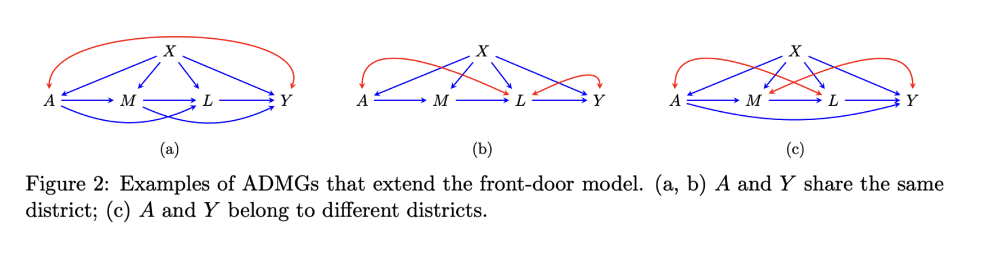

- [Introduction to the folders](#introduction-to-the-folders)
- [Introduction to files](#introduction-to-files)
- [How to run the code](#how-to-run-the-code)

This repository contains code for implementing the simulation studies
discussed in the paper. The four folders, namely sim1-consistency,
sim2-weak-overlap, sim3-misspecification, and sim4-crossfitting-HD,
correspond to the four subsections under the Simulation section in the
paper.

## Introduction to the folders

- `sim1-consistency`: This folder contains code for the simulation 1,
  which is about validating the statistical properties, such as
  consistency and asymptotic linearity, of the estimators.
- `sim2-weak-overlap`: This folder contains code for the simulation 2,
  which is about understanding the behaviors of the estimators under
  weak overlap.
- `sim3-misspecification`: This folder contains code for the simulation
  3, which is about understanding the behaviors of the estimators under
  model misspecification.
- `sim4-crossfitting-HD`: This folder contains code for the simulation
  4, which is about understanding the behaviors of the estimators when
  applied with cross-fitting.

Under each of these folders, there are three subfolders, namely `DGPs`,
`YinL`, and `YnotL`.

- `DGPs`: This folder contains the data generating code and code for
  empirically computing the true ACE and its variance. The true ACE and
  its variance are stored at `YinL-truth.Rdata` and `YnotL-truth.Rdata`.
- `YinL`: This folder contains the code for estimating the ACE under the
  graphical model depicted in Figure 2(a), where the outcome $Y$ is
  *within* the district of the treatment $A$.
- `YnotL`: This folder contains the code for estimating the ACE under
  the graphical model depicted in Figure 2(c), where the outcome $Y$ is
  *not within* the district of the treatment $A$.

Apart from these folders, under `sim1-consistency`, there is one more
folder, namely `YinL-groupML`.

- `YinL-groupML`: This folder contains the code for estimating the ACE
  under the graphical model depicted in Figure 2(a). In estimation, we
  treat the mediators $M$ and $L$ as a single multivariate variable,
  thereby simplifying the DGP to the front-door model, whereas for
  `YinL`, we strictly adhere to the DGP shown in Figure 2(a), treating
  the mediators $M$ and $L$ as separate variables.

Under each of these subfolders, there are seven more estimator
subfolders:

- `dsq`: This folder save the messages generated when executing the code
  for estimation
- `Onestep-dnorm`: This folder contains the code for estimating the ACE
  using the one-step estimator $\psi^+_\text{dnorm}(\hat{Q})$.
- `Onestep-densratio`: This folder contains the code for estimating the
  ACE using the one-step estimator $\psi^+_\text{densratio}(\hat{Q})$.
- `Onestep-bayes`: This folder contains the code for estimating the ACE
  using the one-step estimator $\psi^+_\text{bayes}(\hat{Q})$.
- `TMLE-dnorm`: This folder contains the code for estimating the ACE
  using the TMLE estimator $\psi_\text{dnorm}(\hat{Q}^*)$.
- `TMLE-densratio`: This folder contains the code for estimating the ACE
  using the TMLE estimator $\psi_\text{densratio}(\hat{Q}^*)$.
- `TMLE-bayes`: This folder contains the code for estimating the ACE
  using the TMLE estimator $\psi_\text{bayes}(\hat{Q}^*)$.

The output from these estimators are saved in the `output` folder under
each of these subfolders. Considering the large amount of output files
generated, we omit the output files from this repository. However, the
output files are summarized and stored in `result.Rdata` under each
estimator folder.

For folders, `sim3-misspecification` and `sim4-crossfitting-HD`, there
are several parent folders of these estimator folders:

- `CF`: This folder contains the code for implementing the cross-fitting
  procedure.
- `Linear`: This folder contains the code for estimating the ACE under
  linearity assumption.
- `RF`: This folder contains the code for estimating the ACE using the
  random forest algorithm.
- `SL`: This folder contains the code for estimating the ACE using the
  super learner algorithm.

## Introduction to files

- `joblist*.txt`: This is the job file for simulation. Each line
  corresponds to one simulation. It is recommended to execute the job
  lists using parallel computing.
- `write_job.R`: This is the R script for producing the joblist\*.txt
  files.
- `main.R`: Each line in the job list calls this main.R function to
  perform TMLE and one-step estimation. This file calls the `flexCausal`
  package for estimation and saves estimation results to the output
  folders, located under subfolders named after the estimators.
- `organize.R`: This file is used for organizing the output file from
  one-step estimators and TMLEs. It is called by the `organize.txt` file
  within each estimator folder.
- `organize.txt`: This file contains code for summarizing the files in
  the output folder. Run `bash organize.txt` in terminal to execute.
- `plot.R`: This is used for generating plots for sim1-consistency. This
  file calls `plot-sub.R` for generating smaller plots.
- `plot-sub.R`: This function is called by `plot.R` for generating
  smaller plots.
- `table.R`: This is used for generating tables in the paper.

## How to run the code

We recommend running the code in parallel. To do so, follow these steps:

1.  Under each estimator folder, run `write_job.R` to generate the job
    list file: `Rscript write_job.R`.
2.  Submit the job list file to the cluster for parallel computing.
3.  After the job is done, run `organize.txt` in the output folder to
    summarize the results: `bash organize.txt`.
4.  Run `plot.R` to generate plots for sim1-consistency:
    `Rscript plot.R`. OR run `table.R` to generate tables for the paper:
    `Rscript table.R`. Note, remember to change the working directory to
    your local directory in the code before running the code.
